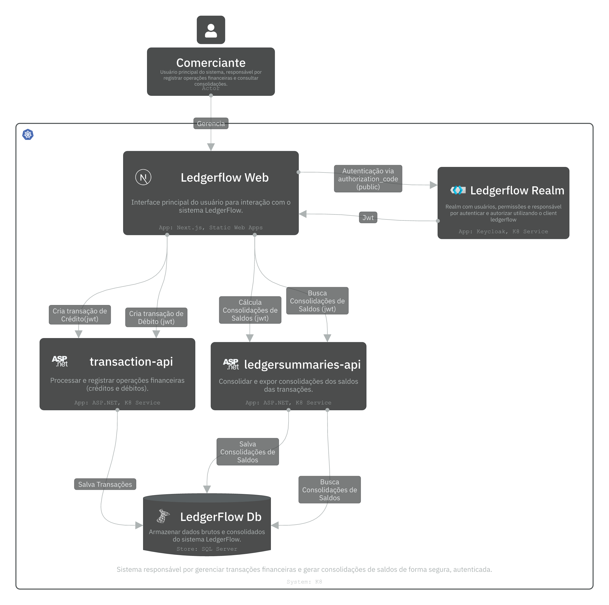

# LedgerFlow

LedgerFlow é uma solução desenvolvida para controle e consolidação de lançamentos financeiros diários (débitos e créditos). O projeto foi criado com foco em escalabilidade, resiliência e boas práticas de arquitetura de software — aplicando princípios de DDD, separação de contextos e testes automatizados.

A arquitetura contempla dois principais serviços:

* **Serviço de Lançamentos (Transactions API):** responsável pelos débitos e créditos do fluxo de caixa.
* **Serviço de Consolidação (LedgerSummaries API):** gera o saldo consolidado diário(ou do momento) com base nas transações registradas.

---

## Resumo
- [🧩 Setup](#setup)
- [⚙️ Funcionalidades](#funcionalidades)
- [🧪 Testes](#testes)
- [🧱 Arquitetura e Design](#arquitetura-e-design)

## 🧩Setup

Abaixo estão as etapas para configurar o ambiente local.

### 1. Subir a infraestrutura com Docker Compose

Certifique-se de ter **Docker** e **Docker Compose** instalados.

No diretório raiz do projeto, execute:

```bash
docker-compose up -d
```

Esse comando inicializa todos os containers necessários (banco de dados SQL Server, APIs, Keycloak, etc).

### 2. Aplicar as migrações do banco de dados

Após os containers estarem rodando, aplique as migrações executando o comando a seguir no terminal:

Ainda no diretório raiz (LedgerFlow), execute:
```
 dotnet tool install --global dotnet-ef
 dotnet ef database update --startup-project LedgerFlow.Transactions.WebApi/LedgerFlow.Transactions.WebApi.csproj
```

Isso criará o schema e as tabelas necessárias no banco de dados configurado via `appsettings.Development.json`.

### 3. Importar realm e clients do Keycloak

O sistema utiliza o **Keycloak** como provedor de identidade.

1. Acesse a interface administrativa do Keycloak [Master Admin Console](http://localhost:2000/admin) com usuário __admin__ e senha **admin**
2. Vá até **Manage realms → Create Realm → Browse Resource file**.
3. Faça upload do arquivo `ledgerflow-realm-export.json`(fornecido com o projeto) e crie o Ledgerflow Realm
4. Entre no [Ledgerflow Admin Console](http://localhost:2000/admin/ledgerflow/console) com usuário **admin** e senha **admin** para testar ou configurar algo a mais.
5. Entre em [clients](http://localhost:2000/admin/ledgerflow/console/#/ledgerflow/clients) e confirme a criação do client público (legderflow).

---

## ⚙️Funcionalidades

```gherkin
  Cenário: Criar uma transação de crédito com valores válidos
    Dado que o usuário informa um valor maior que zero
    Quando o sistema cria uma transação de crédito
    Então a transação deve ser registrada com sucesso
    E o tipo deve ser "Credit"
    E a data de criação deve ser registrada automaticamente
```

```gherkin
 Cenário: Criar uma transação de débito com valores válidos
    Dado que o usuário informa um valor maior que zero
    Quando o sistema cria uma transação de débito
    Então a transação deve ser registrada com sucesso
    E o tipo deve ser "Debit"
    E a data de criação deve ser registrada automaticamente
```

```gherkin
 Cenário: Consolidação e lançamentos (saldo, créditos e débitos)
    Dado que existe uma lista de transações válidas (créditos e débitos)
    Quando o usuário solicitar a consolidação de lançamentos
    Então o sistema deve calcular o total de créditos, débitos e saldo.
```

```gherkin
Cenário: Obter relatórios consolidados de uma data específica
    Dado que o usuário informa uma data de referência válida
    E existam relatórios consolidados cadastrados para essa data
    Quando o sistema processa a requisição de consulta
    Então o sistema retornar a lista de relatórios com seus respectivos saldos, totais de créditos e débitos e data e hora de referência
```

---

## 🧪Testes

### Testes unitários

Os testes unitários cobrem a lógica de domínio e regras de negócio.

Para executá-los:

```bash
dotnet test LedgerFlow.Tests.Unit
```

### Testes Funcionais com Postman
As coleções do Postman permitem validar o comportamento funcional das APIs do LedgerFlow, simulando chamadas reais aos endpoints de transações e consolidados.
1. Abra o Postman e clique em **Import**.  
2. Selecione os arquivos das coleções:  
   `transactions-api.postman_collection.json` e `ledgersummaries-api.postman_collection.json`.
3. Após a importação, abra qualquer requisição e vá até a aba **Authorization**.  
4. Clique em **Get New Access Token** — as configurações de OAuth2 já estarão preenchidas.  
5. Clique em **Use Token** para aplicá-lo automaticamente nas requisições.  
6. Execute as chamadas das rotas para validar o comportamento das APIs.


### Testes de Performance

Para medir o desempenho das APIs, utilize o script configurado em `k6.js` na raiz do projeto.:

1. Abra o arquivo k6.js
2. Selecione o endpoint que deseja testar setando na variável url do objeto request.
3. Busque o token usando a aba Authorization de qualquer coleção importada pelo postman.
4. Adicione o token na variável token no script k6.js
5. Execute:

```bash
cd LedgerFlow
k6 run k6.js
```

---

## 🧱Arquitetura e Design


### C4 Diagrams

O diagrama abaixo apresenta a visão C4 de Nível 2 (App/Container) do sistema LedgerFlow, ilustrando os principais componentes, suas responsabilidades e interações dentro do ecossistema.

As WebApis e o Keycloak estão preparadas para execução em Kubernetes (K8s), promovendo escalabilidade, isolamento de responsabilidades e resiliência.




🔗 [Explorar o diagrama no IcePanel](https://s.icepanel.io/5EJNqZk1BJKyQN/cv24)

<small>Explore para navegar interativamente pelo diagrama, visualizar as conexões entre os componentes e até subir para o Nível 1 (System Context Diagram)</small>

### Domain-Driven Design e Clean Architecture

A solução foi desenhada seguindo princípios de **Domain-Driven Design (DDD)** e **Clean Architecture**, com clara separação entre camadas:

* **LedgerFlow** — projeto de domínio, contém entidades, agregados, eventos de domínio e regras de negócio.
* **LedgerFlow.Infrastructure** — abstrações de persistência, mapeamentos e contexto EF Core.
* **LedgerFlow.Application** — implementa os casos de uso da aplicação, comandos, consultas e orquestração das regras de negócio.
* **LedgerFlow.Transactions.WebApi** — expõe os endpoints responsáveis pelo registro e consulta de transações (créditos e débitos).
* **LedgerFlow.LedgerSummaries.WebApi** — expõe os endpoints responsáveis pela consolidação e consulta dos saldos diários.

#### Referências

- [Domain-Driven Design: Tackling Complexity in the Heart of Software, Eric Evans, 2003](http://chatgpt.com/?q=Livro%20Domain-Driven%20Design,%20Eric%20Evans)
- [Projetar um microsserviço orientado a DDD, Learn Microsoft](https://learn.microsoft.com/pt-br/dotnet/architecture/microservices/microservice-ddd-cqrs-patterns/ddd-oriented-microservice)

---
