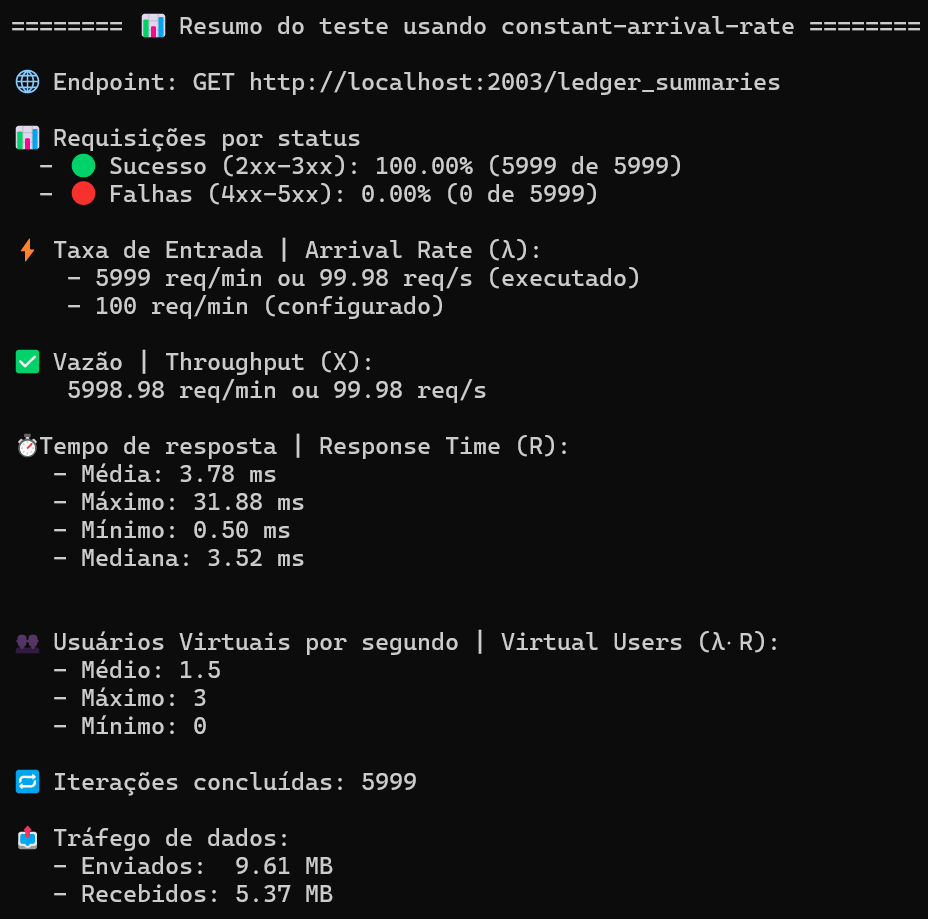
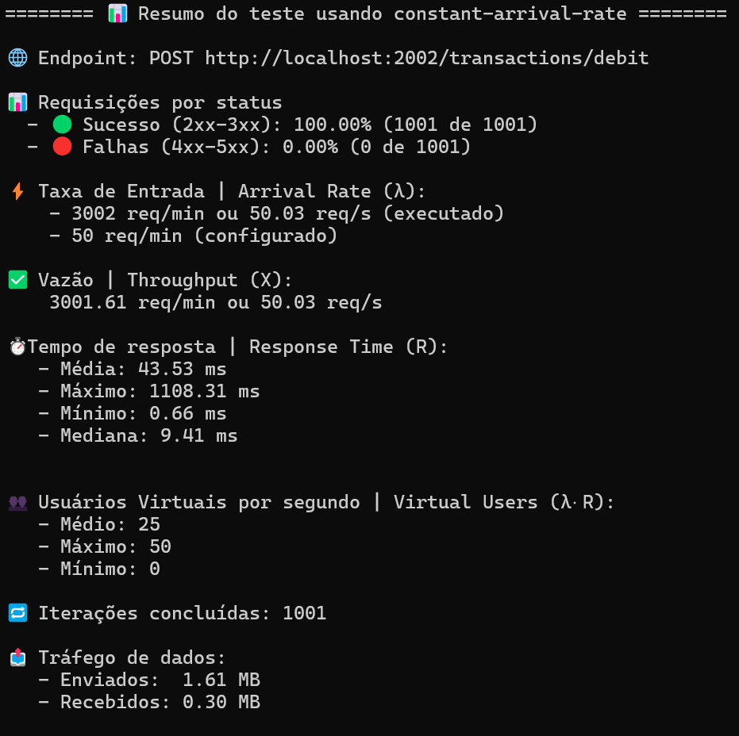

# LedgerFlow

O LedgerFlow é um sistema de gestão financeira projetado para registrar lançamentos de débito e crédito e gerar consolidações diárias de saldo.
A solução adota uma arquitetura moderna baseada em DDD (Domain-Driven Design), com foco em escalabilidade, resiliência e separação de responsabilidades, promovendo uma base sólida para evolução contínua e confiável.

A arquitetura contempla dois principais serviços e uma aplicação front-end que integra as funcionalidades em uma experiência unificada:

- Aplicação Web (LedgerFlow Web): interface web, onde o comerciante interage com o sistema para lançar movimentações, consultar saldos e visualizar o consolidado. Ela se comunica com as APIs autenticadas via Keycloak, garantindo segurança e uma experiência fluida de uso.
- Serviço de Lançamentos (Transactions API): responsável pelos débitos e créditos do fluxo de caixa.
- Serviço de Consolidação (LedgerSummaries API): gera o saldo consolidado com base nas transações registradas.


---

## Estrutura do Projeto

A estrutura do projeto foi pensada para conduzir o leitor pela lógica da solução: inicia nas __Funcionalidades__, que contextualizam o domínio e os objetivos do sistema; segue para a __Arquitetura e o Design__, onde se detalham as decisões técnicas; continua com o __Setup__, que orienta a execução do ambiente; e finaliza com os __Testes__, responsáveis por garantir qualidade e conformidade.

- [⚙️ Funcionalidades](#funcionalidades)
- [🧱 Arquitetura e Design](#arquitetura-e-design)
- [🧩 Setup](#setup)
- [🧪 Testes](#testes)

## ⚙️Funcionalidades

As funcionalidades descritas a seguir representam o coração do sistema LedgerFlow e foram expressas em formato [Gherkin](https://cucumber.io/docs/gherkin/reference), facilitando o entendimento comum entre negócio, desenvolvimento e qualidade. Esse formato torna explícito o comportamento esperado do sistema, conectando histórias de usuário à implementação de forma verificável.

O momento de definir essas funcionalidades é também um ponto crucial de alinhamento entre especialistas de domínio e de modelagem, quando se traduz o conhecimento do negócio em linguagem técnica.

É nesse estágio que o [EventStorming](https://www.eventstorming.com/) pode desempenhar papel fundamental para a modelagem de __sistemas complexos__, promovendo uma visão compartilhada do fluxo de eventos, identificando comandos, agregados e fronteiras de contexto que darão forma à arquitetura do sistema.

```gherkin
  Cenário 1: Criar uma transação de crédito com valores válidos
    Dado que o usuário informa um valor maior que zero
    Quando o sistema cria uma transação de crédito
    Então a transação deve ser registrada com sucesso
    E o tipo deve ser "Credit"
    E a data de criação deve ser registrada automaticamente
```

```gherkin
 Cenário 2: Criar uma transação de débito com valores válidos
    Dado que o usuário informa um valor maior que zero
    Quando o sistema cria uma transação de débito
    Então a transação deve ser registrada com sucesso
    E o tipo deve ser "Debit"
    E a data de criação deve ser registrada automaticamente
```

```gherkin
  Cenário 3: Consolidação de Saldos (saldo, créditos e débitos)
    Dado que existe uma lista de transações válidas (créditos e débitos)
    Quando o usuário solicitar a consolidação dos saldos
    Então o sistema deve calcular e salvar o total de créditos, débitos e saldo.
```

```gherkin
  Cenário 4: Obter Saldos Consolidados de uma data específica
    Dado que o usuário informa uma data de referência válida
    E existam Saldos Consolidados para essa data
    Quando o sistema processa a requisição de consulta
    Então o sistema retornar todos os Saldos Consoliados com seus respectivos saldos, totais de créditos e débitos e data e hora
```

---

## 🧱Arquitetura e Design

A arquitetura do LedgerFlow foi concebida com base em princípios de DDD (Domain-Driven Design) e Clean Architecture, priorizando modularidade, separação de responsabilidades e evolução contínua.
Trata-se de um monólito modular, em que cada módulo, como Transactions e LedgerSummaries é isolado logicamente, mas compartilha a mesma base de dados, permitindo simplicidade operacional e alta coesão interna.
As decisões arquiteturais foram registradas formalmente em ADRs (Architectural Decision Records), documentando o racional técnico por trás das escolhas de design, incluindo estratégias de segurança, observabilidade e escalabilidade que pavimentam o caminho para uma futura migração a uma arquitetura distribuída.

Essas decisões podem ser consultadas em detalhes no arquivo:

📘 [ADRs.md](./docs/ADRs.md)


### Diagrama C4

O diagrama abaixo apresenta a visão C4 de Nível 2 (App/Container) do sistema LedgerFlow, ilustrando os principais componentes, suas responsabilidades e interações dentro do ecossistema.

As WebApis e o Keycloak estão preparadas para execução em Kubernetes (K8s), promovendo escalabilidade, isolamento de responsabilidades e resiliência.


🔗 [Explorar o diagrama no IcePanel](https://s.icepanel.io/5EJNqZk1BJKyQN/cv24)

<small>Explore para navegar interativamente pelo diagrama, visualizar as conexões entre os componentes e até subir para o Nível 1 (System Context Diagram)</small>

### Domain-Driven Design e Clean Architecture

A solução foi desenhada seguindo princípios de **Domain-Driven Design (DDD)** e **Clean Architecture**, com clara separação entre camadas:

* **LedgerFlow** — projeto de domínio, contém entidades, agregados, eventos de domínio e regras de negócio.
* **LedgerFlow.Infrastructure** — abstrações de persistência, mapeamentos e contexto EF Core.
* **LedgerFlow.Application** — implementa os casos de uso da aplicação, comandos, consultas e orquestração das regras de negócio.
* **LedgerFlow.Transactions.WebApi** — expõe os endpoints responsáveis pelo registro e consulta de transações (créditos e débitos).
* **LedgerFlow.LedgerSummaries.WebApi** — expõe os endpoints responsáveis pela consolidação e consulta dos saldos diários.

#### Referências

- [Domain-Driven Design: Tackling Complexity in the Heart of Software, Eric Evans, 2003](http://chatgpt.com/?q=Livro%20Domain-Driven%20Design,%20Eric%20Evans)
- [Projetar um microsserviço orientado a DDD, Learn Microsoft](https://learn.microsoft.com/pt-br/dotnet/architecture/microservices/microservice-ddd-cqrs-patterns/ddd-oriented-microservice)
- [Clean Archicteture Template, Milan Jovanovic](https://github.com/lucasfogliarini/clean-architecture-m-jovanovic)

---

## 🧩Setup

Abaixo estão as etapas para configurar o ambiente local.

### 1. Subir a infraestrutura com Docker Compose

Certifique-se de ter **Docker** e **Docker Compose** instalados.

No diretório raiz do projeto, execute:

```bash
docker-compose up -d
```

Esse comando inicializa todos os containers necessários (banco de dados SQL Server, APIs, Keycloak, etc).

### 2. Aplicar as migrações do banco de dados

Após os containers estarem rodando, aplique as migrações executando o comando a seguir no terminal:

Ainda no diretório raiz (LedgerFlow), execute:
```
 dotnet tool install --global dotnet-ef
 dotnet ef database update --startup-project LedgerFlow.Transactions.WebApi/LedgerFlow.Transactions.WebApi.csproj
```

Isso criará o schema e as tabelas necessárias no banco de dados configurado via `appsettings.json`.  

⚠️ <small>Aviso: As credenciais e senhas presentes nos arquivos de configuração (appsettings.Development.json, docker-compose.yml, etc.) são utilizadas apenas para execução local e têm caráter estritamente práticos para o setup.
Em um ambiente real, essas informações seriam protegidas por mecanismos seguros.</small>

### 3. Importar realm e clients do Keycloak

O sistema utiliza o **Keycloak** como provedor de identidade.

1. Acesse a interface administrativa do Keycloak [Master Admin Console](http://localhost:2000/admin) com usuário __admin__ e senha **admin**
2. Vá até **Manage realms → Create Realm → Browse Resource file**.
3. Faça upload do arquivo `ledgerflow-realm-export.json`(fornecido com o projeto) e crie o Ledgerflow Realm
4. Entre no [Ledgerflow Admin Console](http://localhost:2000/admin/ledgerflow/console) com usuário **admin** e senha **admin** para testar ou configurar algo a mais.
5. Entre em [clients](http://localhost:2000/admin/ledgerflow/console/#/ledgerflow/clients) e confirme a criação do client público (legderflow).

---

## 🧪Testes

### Testes unitários

Os testes unitários cobrem a lógica de domínio e regras de negócio.

Para executá-los:

```bash
dotnet test LedgerFlow.Tests.Unit
```

### Testes Funcionais com Postman
As coleções do Postman permitem validar o comportamento funcional das APIs do LedgerFlow, simulando chamadas reais aos endpoints de transações e consolidados.
1. Abra o Postman e clique em **Import**.  
2. Selecione os arquivos das coleções:  
   `transactions-api.postman_collection.json` e `ledgersummaries-api.postman_collection.json`.
3. Após a importação, abra qualquer requisição e vá até a aba **Authorization**.  
4. Clique em **Get New Access Token** — as configurações de OAuth2 já estarão preenchidas.  
5. Clique em **Use Token** para aplicá-lo automaticamente nas requisições.  
6. Execute as chamadas das rotas para validar o comportamento das APIs.


### Testes de Performance

Para medir o desempenho das APIs, utilize o script configurado em `k6.js` na raiz do projeto.:

1. Abra o arquivo k6.js
2. Selecione o endpoint que deseja testar setando na variável url do objeto request.
3. Busque o token usando a aba Authorization de qualquer coleção importada pelo postman.
4. Adicione o token na variável token no script k6.js
5. Execute:

```bash
cd LedgerFlow
k6 run k6.js
```

#### Testes de Performance (Resultados)

Os testes de performance locais mostraram que o sistema manteve estabilidade e baixa latência mesmo sob carga constante. Ambos os endpoints responderam 100% das requisições com sucesso, apresentando boa vazão e tempos de resposta consistentes, adequados para uso em produção.

<small>O endpoint de consulta de saldos consolidados com cache apresentou um desempenho excelente, com 5.999 requisições processadas com sucesso e tempo médio de resposta de apenas 3,78 ms, indicando alta eficiência em operações de consulta.</small>  


<small>O endpoint de criação de transações de crédito manteve estabilidade sob carga, processando 1.001 requisições com sucesso e tempo médio de resposta de 43,5 ms, com picos ocasionais esperados para operações de gravação.</small>  
